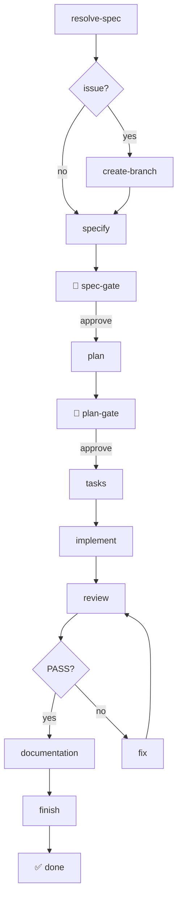
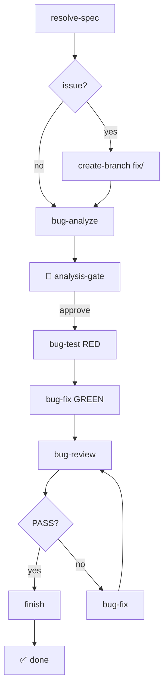

# Spec-Kit Extended Flow

[](https://github.com/markuswondrak/spec-kit-extended-flow/releases/latest)
[](https://github.com/markuswondrak/spec-kit-extended-flow/actions/workflows/release-preset.yml)
[](https://opensource.org/licenses/MIT)


**A complete agentic engineering pipeline that turns intent into working, reviewed, documented software.** Built on [Spec-Kit](https://github.com/github/spec-kit), it extends the standard SDD workflow with deterministic quality gates and living documentation — so every feature that ships is reviewed for correctness *and* documented in sync with the code.

---

- [The Vision](#the-vision)
- [Quickstart](#quickstart)
- [Flows](#flows)
- [Reference](#reference)
- [Operations](#operations)
- [License](#license)

---

## The Vision

The standard Spec-Kit workflow is `specify → plan → tasks → implement`. That's a great start — but it treats implementation as the finish line. For a codebase that grows over time, that's a trap: every cycle adds code without systematic review, documentation drifts silently, and the project gets harder to reason about.

Extended Flow closes the loop. **Intent in, working software out — reviewed against the spec, documented in sync with the code, and shipped as a pull request.** Three principles drive the design:

- **Sustainable.** Every cycle leaves the project healthier. Specs are reviewed against implementation, documentation is reconciled with code, and conflicts are flagged for human resolution — never silently ignored.
- **Agentic.** The pipeline runs end-to-end with AI agents, but with deterministic guard rails and human gates at the right moments. When autonomy conflicts with safety, safety wins.
- **Pipeline.** Each stage feeds cleanly into the next. The output of `resolve-spec` becomes the input of `specify`. The output of `review` drives `fix`. The output of `documentation` feeds into `finish`. No guessing, no regex-based format detection, no silent failures.

| | Standard SDD | Extended Flow |
|---|---|---|
| After implementation | ✅ Done | 🔄 QA Review Loop |
| Documentation | Manual, drifts | Auto-reconciled per layer |
| Code-vs-docs conflicts | Silent | Flagged for human resolution |
| Issue → PR | Manual | Automated branch, commit, PR |

### How the principles become concrete

- **QA Review Loop.** A Review agent analyzes the implementation against the spec. If it finds critical issues, a Fix agent makes targeted corrections and the review runs again. This loops until the reviewer signs off with `PASS` — up to 5 iterations max.
- **Documentation Reconciliation.** After a passing review, a Documentation agent scans all implementation diffs and updates every documentation layer (global constraints, architecture decisions, interface contracts, AI debt register). **Code-vs-docs conflicts are flagged for human resolution — never auto-resolved.** This is a core invariant.
- **Issue → PR automation.** When started from a GitHub issue, the workflow automatically creates a feature branch, cleans up temporary files, commits all changes, and opens a pull request that closes the issue.

### A family of flows

Extended Flow ships a **family of composable flows** that share the same guard rails (QA review loop, safety caps, human gates) and the same documentation model. Today the family has two members:

- **Feature Flow** — the SDD lifecycle for new features (`specify → plan → tasks → implement → review → documentation → finish`).
- **Bugfix Flow** — a TDD lifecycle for surgical bugfixes (`analyze → test → fix → review → finish`), skipping spec/plan/tasks generation.

See [Flows](#flows) for the full diagrams. The family is designed to grow — future flows slot in as peers.

---

## Quickstart

```bash
# 1. Install preset (templates + scripts)
specify preset add --from https://github.com/markuswondrak/spec-kit-extended-flow/releases/latest/download/spec-kit-extended-flow.zip

# 2. Install extension (commands)
specify extension add extendedflow --from https://github.com/markuswondrak/spec-kit-extended-flow/releases/latest/download/spec-kit-extended-flow.zip

# 3. Install the Feature Flow
specify workflow add .specify/presets/spec-kit-extended-flow/workflows/workflow.yml

# 4. Run it
specify workflow run spec-kit-extended-flow \
  --input spec="Build a REST API for managing todos with CRUD operations"
```

**What happens:** The workflow generates your spec, plan, and task list (with human approval gates at each stage), implements everything, runs QA review in a loop until PASS, then reconciles documentation.

### Bugfix Quickstart

```bash
# Install the Bugfix Flow (same preset + extension as Feature Flow)
specify workflow add .specify/presets/spec-kit-extended-flow/workflows/bugfix-workflow.yml

# Run from a GitHub issue
specify workflow run spec-kit-bugfix-flow \
  --input issue="42"
```

**What happens:** The workflow analyzes the bug, writes a failing test (RED), applies a surgical fix (GREEN), runs independent QA review in a loop until PASS, then commits and opens a PR.

<details>
<summary><strong>Other input modes</strong></summary>

```bash
# From a spec file
specify workflow run spec-kit-extended-flow \
  --input file="./specs/todo-api.md"

# From a GitHub issue
specify workflow run spec-kit-extended-flow \
  --input issue="42"

# Bugfix from plain text
specify workflow run spec-kit-bugfix-flow \
  --input spec="The login endpoint returns 500 when password is empty"
```

When started from a GitHub issue, the workflow also:
1. Creates a `feature/42-<slug>` or `fix/42-<slug>` branch from the issue title
2. Cleans up temporary files after completion
3. Commits all changes and opens a pull request that closes the issue
</details>

<details>
<summary><strong>Pin a specific release</strong></summary>

```bash
specify preset add --from https://github.com/markuswondrak/spec-kit-extended-flow/releases/download/v2.1.0/spec-kit-extended-flow.zip
specify extension add extendedflow --from https://github.com/markuswondrak/spec-kit-extended-flow/releases/download/v2.1.0/spec-kit-extended-flow.zip
```
</details>

<details>
<summary><strong>Local development</strong></summary>

For development on a checkout of this repository:

```bash
specify preset add --dev .
specify extension add --dev .
```
</details>

---

## Flows

Extended Flow is a family of composable flows. Each flow is a self-contained pipeline with its own steps, gates, and review loop — but all flows share the same guard rails, documentation model, and issue-to-PR automation.

### Feature Flow

The SDD lifecycle for new features. Generates spec, plan, and tasks, implements them, runs a QA review loop, reconciles documentation, and ships a PR.



| Step | Type | Description |
|------|------|-------------|
| `resolve-spec` | shell | Resolves file paths and GitHub issues to spec content |
| `create-branch` | shell | *(issue only)* Creates `feature/<issue>-<slug>` branch |
| `specify` | command | Generates the specification from your input |
| `spec-gate` | gate | 🛑 Human approval before planning |
| `plan` | command | Creates implementation plan (infers from project) |
| `plan-gate` | gate | 🛑 Human approval before task generation |
| `tasks` | command | Generates actionable task breakdown |
| `implement` | command | Implements the tasks |
| `review` | command | QA review against the spec → PASS or FAIL |
| `fix` | command | Targeted fixes for review findings |
| `documentation` | command | Updates all documentation layers |
| `finish` | command | Cleans up, commits, opens PR when issue provided |

**Safety caps:** Review loop maxes out at 5 iterations. Human gates let you inspect and approve each phase. Workflow state is persisted — resume from any interruption with `specify workflow resume <run_id>`.

### Bugfix Flow

A TDD lifecycle for surgical bugfixes. It skips spec/plan/tasks generation and instead follows a **RED-GREEN-REVIEW** cycle, then ships a PR.



1. **Analyze** — Root-cause diagnosis with test plan
2. **Test (RED)** — Write a failing test that reproduces the bug
3. **Fix (GREEN)** — Surgical fix until the test passes
4. **Review** — Independent QA review against the analysis
5. **Loop** — Review loops until PASS or max 5 iterations

When started from a GitHub issue, the Bugfix Flow creates a `fix/<issue>-<slug>` branch and opens a PR with a `fix:` conventional commit prefix.

**Safety caps:** Same as Feature Flow — review loop maxes out at 5 iterations, with a human gate after analysis.

---

## Reference

### Spec Input Parameters

Both flows accept three input parameters. At least one must be provided. If multiple are provided, their contents are concatenated.

| Parameter | Type | Example | How it works |
|-----------|------|---------|--------------|
| `spec` | Plain text | `--input spec="Build a user auth system with OAuth"` | Passed directly to `speckit.specify` |
| `file` | File path | `--input file="./specs/feature.md"` | File content is read and passed as the spec |
| `issue` | Issue number | `--input issue="42"` | Issue title + body fetched via `gh` CLI |

**GitHub issues** require `gh` CLI installed and authenticated. **File input** must exist relative to your working directory.

### Individual Commands

Run these standalone outside the workflows:

| Command | Purpose |
|---------|---------|
| `/speckit.extendedflow.review` | QA review only |
| `/speckit.extendedflow.documentation` | Documentation reconciliation only |
| `/speckit.extendedflow.documentation-init` | Bootstrap documentation for an existing project |
| `/speckit.extendedflow.finish` | Cleanup, commit, and PR (post-implementation) |

### Architecture

Extended Flow is delivered as **two packages** — a preset (templates + scripts) and an extension (commands) — following the Spec-Kit separation of concerns:

| Package | Manifest | Delivers | Installed via |
|---------|----------|----------|---------------|
| Preset | `preset.yml` | Templates, scripts | `specify preset add` |
| Extension | `extension.yml` | Commands (agent prompts) | `specify extension add` |
| Workflow | `workflows/workflow.yml` | Step orchestration | `specify workflow add` |

This split exists because Spec-Kit's architecture reserves commands for extensions. Presets provide output formats; extensions provide agent behaviors. The two-package design ensures commands are properly deployed across all integration targets (Claude, Copilot, Gemini, opencode).

#### Key Design Principles

- **Deterministic safety.** Verdict extraction, input validation, conflict flagging, and format checks produce reproducible outcomes. When the pipeline passes, fails, or flags a conflict, you can understand why without reading source code.
- **Human gates as fallback, not requirement.** Every guard rail is deterministic and inspectable. Human gates are available but not required for correct results.
- **Never auto-resolve code-vs-docs conflicts.** The documentation reconciler flags contradictions for human resolution. This is a core invariant.
- **Single-responsibility inputs.** Each input parameter (`spec`, `file`, `issue`) has exactly one resolution strategy. No regex-based format detection, no guessing.

#### Component Map

| Component | File | Role |
|-----------|------|------|
| Review agent | `commands/speckit.extendedflow.review.md` | QA agent system prompt |
| Fix agent | `commands/speckit.extendedflow.fix.md` | Targeted fix agent system prompt |
| Documentation agent | `commands/speckit.extendedflow.documentation.md` | Doc reconciliation agent prompt |
| Documentation init | `commands/speckit.extendedflow.documentation-init.md` | Doc bootstrap agent prompt |
| Project init | `commands/speckit.extendedflow.project-init.md` | Project analysis + template tailoring agent prompt |
| Finish agent | `commands/speckit.extendedflow.finish.md` | Cleanup, commit, PR agent prompt |
| Review template | `templates/review-findings.md` | Structured review output format |
| Doc template | `templates/documentation.md` | Structured doc reconciliation format |
| Bug analysis template | `templates/bug-analysis.md` | Structured bug analysis output format |
| Resolve spec | `scripts/resolve-spec.sh` | Resolves spec/file/issue inputs |
| Create branch | `scripts/create-branch.sh` | Creates feature branch from issue |
| Verify spec | `scripts/verify-spec.sh` | Validates spec file was created |
| Extract verdict | `scripts/extract-verdict.sh` | Extracts PASS/FAIL from review filename |

### Customization

#### Model and integration configuration

Every command step references the `integration` workflow input, which defaults to `"auto"`. Spec-Kit resolves `"auto"` automatically from `.specify/integration.json` (created by `specify init`), so the workflow dispatches to the AI the project was initialized with — no manual configuration needed. Each step also has a `model` attribute that defaults to `""` (agent default).

**To override per-run**, pass `--input integration=<key>`:

```bash
specify workflow run spec-kit-extended-flow --input integration=claude
```

**To customize permanently**, edit the installed workflow directly. Open `.specify/workflows/<id>/workflow.yml` and replace `{{ inputs.integration }}` with a literal integration key on the steps you want to configure:

```yaml
  - id: plan
    command: speckit.plan
    integration: "opencode"
    model: "glm"
    # ...

  - id: implement
    command: speckit.implement
    integration: "opencode"
    model: "kimi"
    # ...
```

This lets you pair agents and models to their strengths — for example, a reasoning-focused model for planning and a coding-focused model for implementation — without passing inputs on every run.

> **Note:** Model overrides are passed through to the agent CLI (e.g. `opencode run -m <model>`). Support depends on the integration. The opencode integration forwards `-m` automatically; other integrations may ignore the model field.

#### Template overrides and stacking

Override templates and adjust review strictness by copying files to `.specify/templates/overrides/`. See [`preset.yml`](./preset.yml) for the full list of overridable templates.

Stack with other presets using priority ordering:

```bash
specify preset add healthcare-compliance --priority 10
specify preset add --from https://github.com/markuswondrak/spec-kit-extended-flow/releases/latest/download/spec-kit-extended-flow.zip --priority 5
```

---

## Operations

### Prerequisites

Run these **before** the first workflow — they set up your project's foundation:

```bash
# 1. Initialize Spec-Kit (if not already done)
specify init

# 2. Establish project constitution (governing principles)
/speckit.constitution Create principles focused on code quality, testing standards, and performance

# 3. Tailor templates to your project (also handles the git-extension incompatibility — see below)
/speckit.extendedflow.project-init

# 4. (Optional) Bootstrap documentation for existing projects
/speckit.extendedflow.documentation-init
```

The workflows assume your project is already initialized and has a constitution in place. The plan step infers tech stack/architecture from your existing project — no planning constraints input needed at runtime.

`speckit.extendedflow.project-init` analyzes your codebase, generates project-specific template overrides, and **automatically disables spec-kit's git extension** to prevent the incompatibility described below.

### Git Extension Compatibility

Extended Flow manages its own branch creation (issue-based naming: `feature/<issue>-<slug>`) and conflicts with spec-kit's built-in git extension, which uses sequential numbering (`001-<slug>`) via a `before_specify` hook.

`speckit.extendedflow.project-init` runs `specify extension disable git` automatically during setup and reports the outcome. You do not need to do this manually.

**Why this is necessary:**
- The git extension registers a mandatory `before_specify` hook (`speckit.git.feature`) that creates branches with sequential numbering
- Our workflows create branches with issue-based naming via `create-branch.sh`
- On integrations that do not support the `EXECUTE_COMMAND` protocol (e.g., opencode), the mandatory hook causes the agent to hang waiting for a result that never comes
- Disabling the git extension eliminates the conflict and allows the workflows to manage branching consistently

**What you lose:**
- Auto-commits after each SDD step (optional and disabled by default anyway)
- `speckit.git.feature` command (our workflows handle branch creation instead)

**What you keep:**
- All core spec-kit commands (`speckit.specify`, `speckit.plan`, `speckit.tasks`, `speckit.implement`)
- All extended flow commands (`speckit.extendedflow.review`, `speckit.extendedflow.fix`, etc.)
- Issue-to-PR automation via the `finish` command

To re-enable the git extension later (if you stop using Extended Flow):
```bash
specify extension enable git
```

### Troubleshooting

<details>
<summary><strong>Common issues and fixes</strong></summary>

**Reviewer always returns FAIL:** Check that `.specify/spec.md` is up to date. Review findings are inside the current feature directory (`specs/<NNN>-<feature>/review-findings.md`). Adjust `max_iterations` in `workflows/workflow.yml` if needed.

**Workflow stuck in loop:** Check `specify workflow status`. The cap of 5 iterations prevents infinite loops.

**Workflow not found by ID:** Install it: `specify workflow add .specify/presets/spec-kit-extended-flow/workflows/workflow.yml`

**GitHub issue not resolving:** Ensure `gh` CLI is installed and authenticated (`gh auth status`). The `issue` parameter only supports issues from the current repository (bare number, e.g., `42`). Cross-repo references and full URLs are not supported.

**Commands not appearing:** Ensure both the preset and extension are installed:
```bash
specify preset add --from https://github.com/markuswondrak/spec-kit-extended-flow/releases/latest/download/spec-kit-extended-flow.zip
specify extension add extendedflow --from https://github.com/markuswondrak/spec-kit-extended-flow/releases/latest/download/spec-kit-extended-flow.zip
```

**No spec created after specify step (specs/ is empty):** This happens when the git extension's `before_specify` hook tries to execute via `EXECUTE_COMMAND`, but the integration does not support it (e.g., opencode). The workflow includes a `verify-spec` safety net that catches this and aborts with a clear error. To fix: run `/speckit.extendedflow.project-init` (which disables the git extension), or manually run `specify extension disable git`. See [Git Extension Compatibility](#git-extension-compatibility) above.
</details>

### Installation Notes

`specify preset add --from` expects a ZIP package URL. The same applies to `specify extension add --from`. Do not pass the GitHub repository landing page URL — that downloads HTML, not a preset package.

Release packages are built as `dist/spec-kit-extended-flow.zip` by `scripts/package-preset.sh` and published as GitHub Release assets by `.github/workflows/release-preset.yml`.

### Releasing

To cut a new release:

```bash
scripts/release-version.sh 1.2.3
git push origin main --tags
```

This validates the version format (semver), updates `preset.yml` and `extension.yml`, commits the bump, creates an annotated tag, and triggers the GitHub Actions release workflow.

---

## License

MIT
