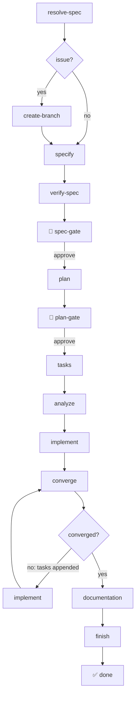
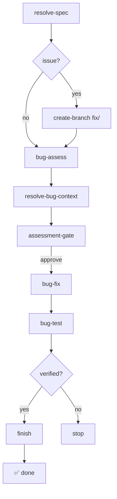
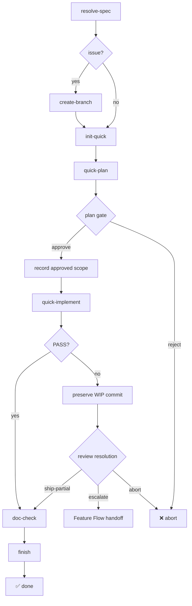

# Flows

Extended Flow is a family of composable flows. Each flow is a self-contained pipeline with its own steps and gates, while issue-to-PR automation and safety boundaries are shared across the family.

Shell steps only interpolate the engine-validated `context.run_id`. User-provided `spec`, `file`, and `issue` text and step stdout are read from the engine-owned run directory (`.specify/workflows/runs/<run_id>/`) instead of being spliced into the command line, so backticks, `$(...)`, and other shell metacharacters in issue bodies can never be executed as shell syntax.

Every flow starts with a `load-models` shell step that resolves per-step model overrides from `model.config.json` (see [Reference](reference.md#per-step-models)). Each command step binds its `model` from that step's `output.data`.

The bundle also installs the `sub-agent-delegation` preset, which prepends a mechanism-neutral delegation preamble to the parallelizable core commands. It lets agents run independent work (research unknowns, `[P]` tasks, analyze passes, issue creation) in parallel using their backend's sub-agent primitive, and falls back to sequential execution when the backend has none. See [Reference](reference.md#sub-agent-delegation).

## Feature Flow

The SDD lifecycle for new features. Generates spec, plan, and tasks, runs a consistency analysis, implements them, iterates through Spec-Kit's standard implement/converge loop, reconciles documentation, and ships a PR.

| Step | Type | Description |
|------|------|-------------|
| `resolve-spec` | shell | Resolves the run's `spec`/`file`/`issue` inputs to spec content |
| `load-models` | shell | Loads per-step model overrides from `model.config.json` |
| `create-branch` | shell | *(issue only)* Creates `feature/<issue>-<slug>` branch |
| `specify` | command | Generates the specification from your input |
| `verify-spec` | shell | Confirms the specification was actually written |
| `spec-gate` | gate | 🛑 Human approval before planning |
| `plan` | command | Creates implementation plan (infers from project) |
| `plan-gate` | gate | 🛑 Human approval before task generation |
| `tasks` | command | Generates actionable task breakdown |
| `analyze` | command | Cross-artifact consistency & coverage analysis (standard) |
| `implement` | command | Implements the tasks |
| `converge` | command | Assesses code against spec/plan/tasks; appends remaining work (standard) |
| `documentation` | command | Updates all documentation layers |
| `finish` | command | Cleans up, commits, opens PR when issue provided |

**Safety caps:** The implement/converge loop maxes out at 5 iterations — if converge still appends tasks after the cap, the workflow fails with a clear error. Human gates let you inspect and approve each phase. Workflow state is persisted — resume from any interruption with `specify workflow resume <run_id>`.

## Bugfix Flow

A standard Spec-Kit bug lifecycle for surgical bugfixes. It skips spec/plan/tasks generation and uses the upstream `bug` extension's assessment, fix, and verification commands.

1. **Assess** — Standard bug assessment writes `.specify/bugs/<slug>/assessment.md`
2. **Approve** — Human gate reviews the assessment before source changes
3. **Fix** — Standard bug fix applies remediation and records `fix.md`
4. **Test** — Standard bug test verifies the fix and records `test.md`
5. **Finish** — Extended Flow cleans up, commits, and opens a PR when an issue was provided

When started from a GitHub issue, the Bugfix Flow creates a `fix/<issue>-<slug>` branch and opens a PR with a `fix:` conventional commit prefix.

**Safety:** The upstream bug commands refuse ambiguous or invalid bug reports and do not overwrite existing reports automatically. Extended Flow adds a human assessment gate and fails unless verification is `verified`.

## Quick Flow

A lightweight pipeline for trivial, well-defined changes. It skips spec and task-list generation; instead it produces a **minimal plan** that a human approves at a gate before implementation. The plan hash is recorded in `approved-scope.json`, which makes it the reviewer’s authoritative scope. It uses a **self-fixing review** in a single pass — the reviewer finds issues and fixes them in one step.

1. **Init** — Create or reuse the feature directory and `feature.json` pointer
2. **Plan** — Produce a minimal plan from the instruction (no tasks.md)
3. **Plan Gate** — Human reviews `plan.md`; approve to implement, reject to stop
4. **Record Scope** — Hash the approved plan into `approved-scope.json`
5. **Implement** — Direct implementation from the instruction and approved plan
6. **Review + Fix** — Self-fixing review against approved scope in a single pass
7. **Review Resolution** — A FAIL first preserves a WIP commit, then offers partial ship, Feature Flow escalation, or abort
8. **Doc Check** — Lightweight documentation impact check
9. **Finish** — Cleanup, commit, PR

| Step | Type | Description |
|------|------|-------------|
| `resolve-spec` | shell | Resolves the run's `spec`/`file`/`issue` inputs to instruction content |
| `load-models` | shell | Loads per-step model overrides from `model.config.json` |
| `create-branch` | shell | *(issue only)* Creates `feature/<issue>-<slug>` branch |
| `init-quick` | shell | Creates or reuses the feature directory and writes `feature.json` with `type: "quick"` |
| `quick-plan` | command | Produces a minimal `plan.md` from the instruction |
| `quick-plan-gate` | gate | Human approves or rejects the plan |
| `record-quick-scope` | shell | Writes the approved plan hash to `approved-scope.json` |
| `quick-implement` | command | Implements the change from the instruction and approved plan |
| `quick-review` | command | Self-fixing review against approved scope: reviews and corrects in one pass → PASS or FAIL |
| `preserve-quick-review` | shell | On FAIL, commits the current work before a human decision |
| `quick-review-resolution` | gate | On FAIL, choose partial ship, Feature Flow handoff, or abort |
| `doc-check` | command | Lightweight documentation impact check, flags conflicts |
| `finish` | command | Cleans up, commits (`chore:` prefix), opens PR when issue provided |

**When to use Quick Flow:** Label renames, message additions, small tweaks — changes that are unambiguous, localized, and need no design decisions. Explicitly deferred or out-of-scope plan items do not fail review. If an approved-scope issue remains after the self-fixing review, Quick Flow preserves the work and lets the operator ship the reviewed partial change, escalate the branch to Feature Flow, or abort.
