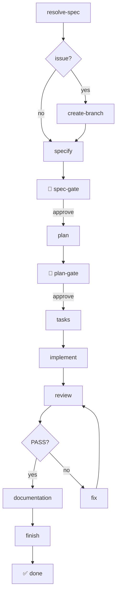
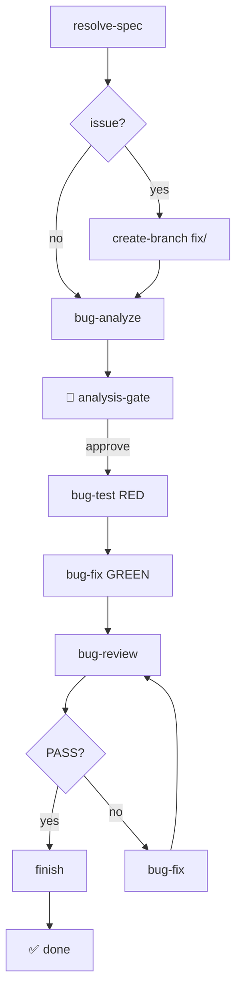
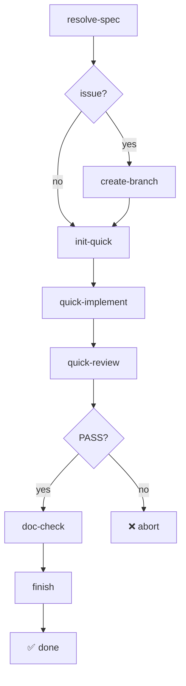

# Flows

Extended Flow is a family of composable flows. Each flow is a self-contained pipeline with its own steps, gates, and review loop — but all flows share the same guard rails, documentation model, and issue-to-PR automation.

## Feature Flow

The SDD lifecycle for new features. Generates spec, plan, and tasks, implements them, runs a QA review loop, reconciles documentation, and ships a PR.

| Step | Type | Description |
|------|------|-------------|
| `resolve-spec` | shell | Resolves file paths and GitHub issues to spec content |
| `create-branch` | shell | *(issue only)* Creates `feature/<issue>-<slug>` branch |
| `specify` | command | Generates the specification from your input |
| `spec-gate` | gate | 🛑 Human approval before planning |
| `plan` | command | Creates implementation plan (infers from project) |
| `plan-gate` | gate | 🛑 Human approval before task generation |
| `tasks` | command | Generates actionable task breakdown |
| `implement` | command | Implements the tasks |
| `review` | command | QA review against the spec → PASS or FAIL |
| `fix` | command | Targeted fixes for review findings |
| `documentation` | command | Updates all documentation layers |
| `finish` | command | Cleans up, commits, opens PR when issue provided |

**Safety caps:** Review loop maxes out at 5 iterations. Human gates let you inspect and approve each phase. Workflow state is persisted — resume from any interruption with `specify workflow resume <run_id>`.

## Bugfix Flow

A TDD lifecycle for surgical bugfixes. It skips spec/plan/tasks generation and instead follows a **RED-GREEN-REVIEW** cycle, then ships a PR.

1. **Analyze** — Root-cause diagnosis with test plan
2. **Test (RED)** — Write a failing test that reproduces the bug
3. **Fix (GREEN)** — Surgical fix until the test passes
4. **Review** — Independent QA review against the analysis
5. **Loop** — Review loops until PASS or max 5 iterations

When started from a GitHub issue, the Bugfix Flow creates a `fix/<issue>-<slug>` branch and opens a PR with a `fix:` conventional commit prefix.

**Safety caps:** Same as Feature Flow — review loop maxes out at 5 iterations, with a human gate after analysis.

## Quick Flow

A lightweight pipeline for trivial, well-defined changes. It skips spec/plan/tasks generation entirely and uses a **self-fixing review** in a single pass — the reviewer finds issues and fixes them in one step.

1. **Init** — Create feature directory and `feature.json` pointer
2. **Implement** — Direct implementation from the instruction (no tasks.md)
3. **Review + Fix** — Self-fixing review in a single pass
4. **Doc Check** — Lightweight documentation impact check
5. **Finish** — Cleanup, commit, PR

| Step | Type | Description |
|------|------|-------------|
| `resolve-spec` | shell | Resolves file paths and GitHub issues to instruction content |
| `create-branch` | shell | *(issue only)* Creates `feature/<issue>-<slug>` branch |
| `init-quick` | shell | Creates feature directory and `feature.json` with `type: "quick"` |
| `quick-implement` | command | Implements the change directly from the instruction |
| `quick-review` | command | Self-fixing review: reviews and corrects in one pass → PASS or FAIL |
| `doc-check` | command | Lightweight documentation impact check, flags conflicts |
| `finish` | command | Cleans up, commits (`chore:` prefix), opens PR when issue provided |

**When to use Quick Flow:** Label renames, message additions, small tweaks — changes that are unambiguous, localized, and need no design decisions. If the self-fixing review returns FAIL, the change is too complex for Quick Flow and belongs in the Feature Flow.
