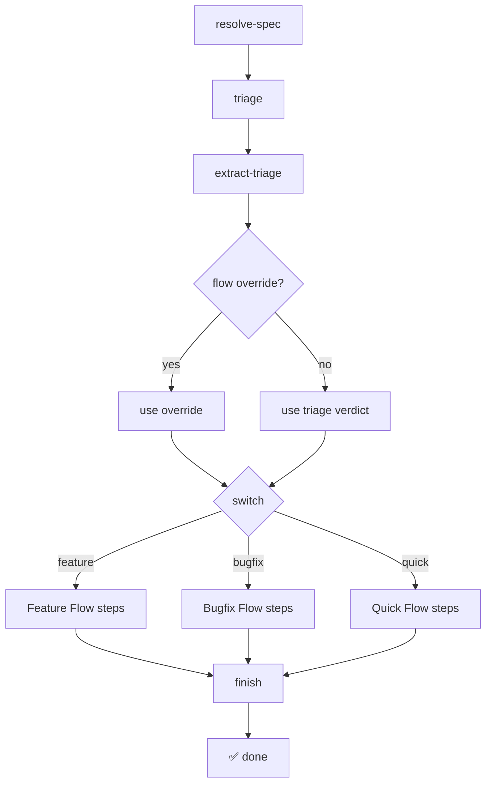
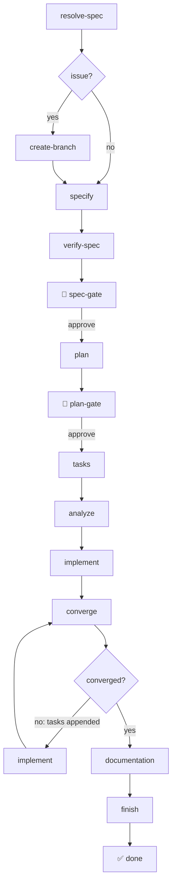
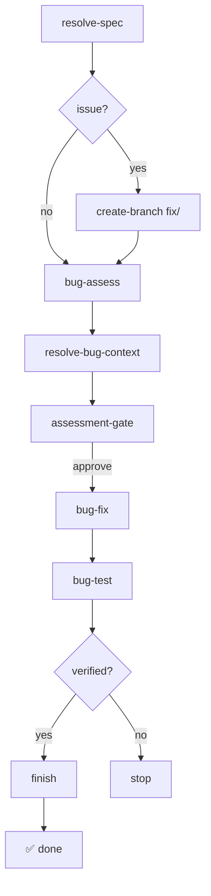
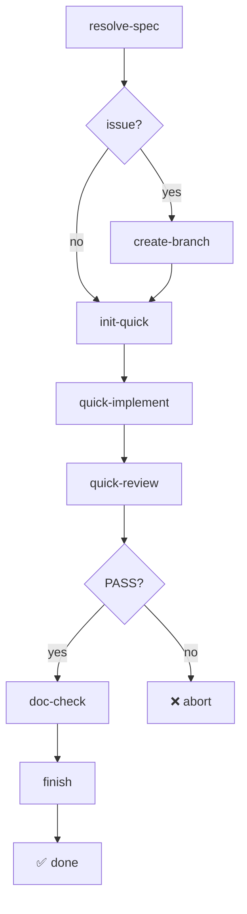

# Flows

Extended Flow is a family of composable flows. Each flow is a self-contained pipeline with its own steps and gates, while issue-to-PR automation and safety boundaries are shared across the family.

## Unified Flow

The recommended entry point. It triages the request into Feature, Bugfix, or Quick, then dispatches to the matching inline branch. You can override the triage with `--input flow=<feature|bugfix|quick>`.

| Step | Type | Description |
|------|------|-------------|
| `resolve-spec` | shell | Resolves file paths and GitHub issues to request content |
| `triage` | command | Triage Agent estimates change type and writes `triage-{VERDICT}.md` |
| `triage-verdict` | shell | Extracts `feature`/`bugfix`/`quick` from the triage filename |
| `dispatch` | switch | Routes to the Feature, Bugfix, or Quick branch |
| `finish` | command | Cleans up, commits, opens PR when issue provided |

**Safety caps:** The triage verdict is encoded in the filename and extracted deterministically. An explicit `--input flow=...` overrides the agent. If the verdict is somehow invalid, the workflow pauses at a gate.

## Feature Flow

The SDD lifecycle for new features. Generates spec, plan, and tasks, runs a consistency analysis, implements them, iterates through Spec-Kit's standard implement/converge loop, reconciles documentation, and ships a PR.

| Step | Type | Description |
|------|------|-------------|
| `resolve-spec` | shell | Resolves file paths and GitHub issues to spec content |
| `create-branch` | shell | *(issue only)* Creates `feature/<issue>-<slug>` branch |
| `specify` | command | Generates the specification from your input |
| `verify-spec` | shell | Confirms the specification was actually written |
| `spec-gate` | gate | 🛑 Human approval before planning |
| `plan` | command | Creates implementation plan (infers from project) |
| `plan-gate` | gate | 🛑 Human approval before task generation |
| `tasks` | command | Generates actionable task breakdown |
| `analyze` | command | Cross-artifact consistency & coverage analysis (standard) |
| `implement` | command | Implements the tasks |
| `converge` | command | Assesses code against spec/plan/tasks; appends remaining work (standard) |
| `documentation` | command | Updates all documentation layers |
| `finish` | command | Cleans up, commits, opens PR when issue provided |

**Safety caps:** The implement/converge loop maxes out at 5 iterations — if converge still appends tasks after the cap, the workflow fails with a clear error. Human gates let you inspect and approve each phase. Workflow state is persisted — resume from any interruption with `specify workflow resume <run_id>`.

## Bugfix Flow

A standard Spec-Kit bug lifecycle for surgical bugfixes. It skips spec/plan/tasks generation and uses the upstream `bug` extension's assessment, fix, and verification commands.

1. **Assess** — Standard bug assessment writes `.specify/bugs/<slug>/assessment.md`
2. **Approve** — Human gate reviews the assessment before source changes
3. **Fix** — Standard bug fix applies remediation and records `fix.md`
4. **Test** — Standard bug test verifies the fix and records `test.md`
5. **Finish** — Extended Flow cleans up, commits, and opens a PR when an issue was provided

When started from a GitHub issue, the Bugfix Flow creates a `fix/<issue>-<slug>` branch and opens a PR with a `fix:` conventional commit prefix.

**Safety:** The upstream bug commands refuse ambiguous or invalid bug reports and do not overwrite existing reports automatically. Extended Flow adds a human assessment gate and fails unless verification is `verified`.

## Quick Flow

A lightweight pipeline for trivial, well-defined changes. It skips spec/plan/tasks generation entirely and uses a **self-fixing review** in a single pass — the reviewer finds issues and fixes them in one step.

1. **Init** — Create feature directory and `feature.json` pointer
2. **Implement** — Direct implementation from the instruction (no tasks.md)
3. **Review + Fix** — Self-fixing review in a single pass
4. **Doc Check** — Lightweight documentation impact check
5. **Finish** — Cleanup, commit, PR

| Step | Type | Description |
|------|------|-------------|
| `resolve-spec` | shell | Resolves file paths and GitHub issues to instruction content |
| `create-branch` | shell | *(issue only)* Creates `feature/<issue>-<slug>` branch |
| `init-quick` | shell | Creates feature directory and `feature.json` with `type: "quick"` |
| `quick-implement` | command | Implements the change directly from the instruction |
| `quick-review` | command | Self-fixing review: reviews and corrects in one pass → PASS or FAIL |
| `doc-check` | command | Lightweight documentation impact check, flags conflicts |
| `finish` | command | Cleans up, commits (`chore:` prefix), opens PR when issue provided |

**When to use Quick Flow:** Label renames, message additions, small tweaks — changes that are unambiguous, localized, and need no design decisions. If the self-fixing review returns FAIL, the change is too complex for Quick Flow and belongs in the Feature Flow.
